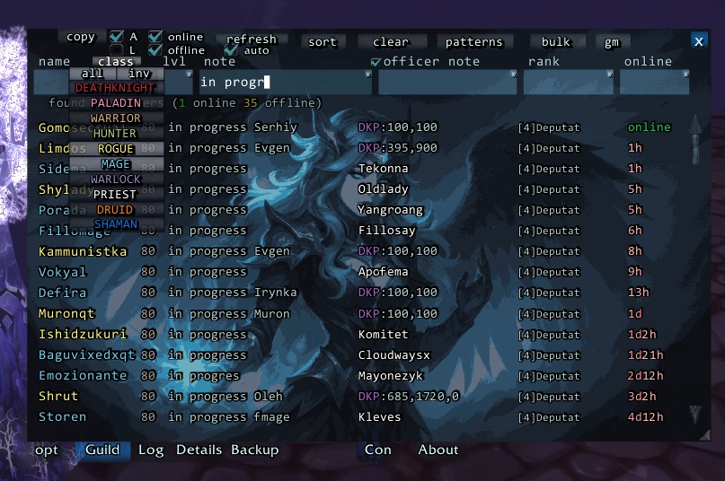
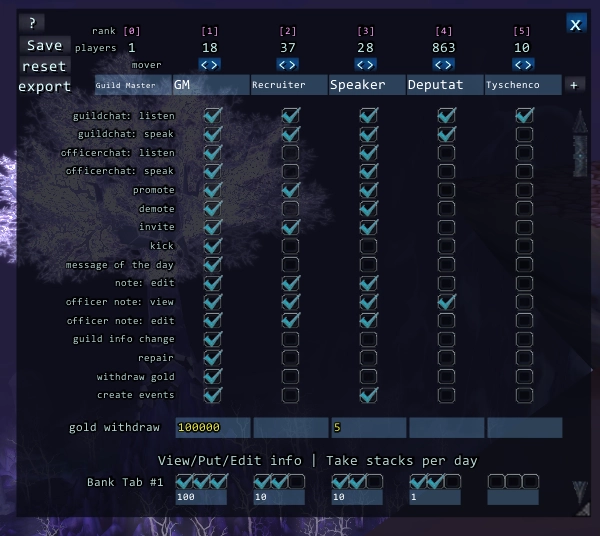
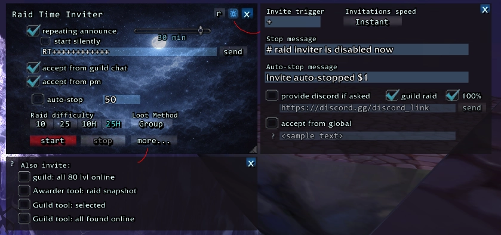
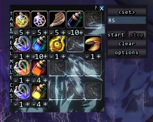

# DarkAngel for Wrath of the Lich King `3.3.5`

DarkAngel добавляет инструменты для управления гильдией, рейдами, лутом, EPGP/DKP начислений, логирования и некоторых автоматизаций.

Система построена из независимых модулей, которые могут использоваться как совместно, так и частично.

---

# Modules Overview
- Core / Guild tools: `DarkAngel`
- Raid Time Inviter: `DarkAngel_Inviter`
- Flask Dispenser: `DarkAngel_Dispenser`
- Raid / Award tool: `DarkAngel_Awarder`
- Loot Distribution: `DarkAngel_BidTracker`
- Guild Logging: `DarkAngel_Logger`
- Guild Data Backup: `DarkAngel_Backup`

---

# Core — DarkAngel
Core-модуль предоставляет базовую инфраструктуру, shared API и общие UI-компоненты для всех модулей аддона.

### Функционально, модуль добавляет:
- Браузер гильдии (поиск, сортировка, шаблоны)
- Система локальных привязок - возможность привязать игрока без приглашения в гильдию (основной функционал завязан на модуле Awarder)
- Поддержка EPGP/DKP систем
- Общие утилиты для работы с гильдией, точечно и массовые

### Guild Browser (Guild Viewer)

    

Полноценный браузер гильдии со следующими возможностями:
- Поиск по:
    - нику
    - уровню (`>15`, `<80`, `>70<79`)
    - рангу (работает математика поиска по айди ранга как в "уровень", так и поиск по названию ранга)
    - заметкам / оф. заметкам
    - last online
    - класс (реализовано через выпадающее меню возле колонки "ник")

- Сортировка:
    - по любым колонкам
    - кастомные сортировки (EPGP, DKP, PR, Total/Net/Hrs)
    - группировка main + alts с сортировкой по наименьшему online
    - реверс сортировки
    - раздельная группировка онлайн/оффлайн

- Фильтры:
    - только мейны / твинки
    - (EPGP) "замороженные"
    - игроки без привязки
    - ошибки привязки / "двойные твины"
    - привязка к ливнувшим игрокам

- Bulk операции:
    - массовая смена заметок / оф. заметок
    - смена рангов
    - начисление/снятие EP/GP/DKP
    - массовый кик
    - перепривязка твинов между мейнами

- Inline редактирование:
    - редактирование ранга / заметок
    - подсветка похожих значений

### GM View

    

Админ-панель управления структурой гильдии:
(доступно любому игроку гильдии, но вносить изменения может только ГМ)

- визуальная схема рангов:
    - права для каждого ранга
    - создание / копирование и перемещение рангов в любую позицию (планирование)
    - перемещение игроков между рангами (планирование)
    - Все ранги и все права на одной странице
- экспорт / импорт конфигураций
- интеграция с Log модулем
- применение изменений одним действием
- автоматический backup перед применением

---

# DarkAngel_Inviter

    

Автоматизация гильдейских сборов на Raid Time.

### Возможности:
- авто-инвайт по ключевым словам (по дефолту, "+")
- авто-анонс рейда в гильд. чат
- работа через:
    - guild chat
    - whisper
    - LFG / global channels
        - работает через "секретную фразу"
- автоостановка по таймеру
    - таймер в минутах
    - конкретное время остановки
- Discord link auto-send при запросах
- bulk invite:
  - онлайн 80lvl гильдии
  - snapshot рейда из Awarder
  - игроки из Guild Browser
    - все соответствующие поиску
    - выделенные через Ctrl/Shift

- настройки рейда:
  - loot method
  - difficulty

---

# DarkAngel_Dispenser

    

Автоматическая раздача consumables в рейде.

### Возможности:
- определение роли игрока:
  - tank / healer / melee / ranged
- автоматическая выдача предметов:
  - еда
  - фласки
  - зелья
- до 5 предметов на роль
- системы наборов (preset packs)
- проверка гильдейской принадлежности
- отслеживание получения предметов
- кто уже получил: интеграция с Awarder модулем

---

# DarkAngel_Awarder
Рейд-менеджер и система начислений EPGP/DKP.

### Возможности:

#### Raid UI
- отображение рейда (1–8 группы)
- цвет классов
- статусы (ready check, RL / assist, Master Looter, Main Tank / Off Tank)
- drag & drop управление игроками/группами
- условно-цветовое отображение игроков:
    - ⬜ Normal — everything is OK (no issues detected)
    - 🟩 External link — not in guild, but locally linked to a guild main
        - такой игрок может получать награду за рейд или учавствовать в разроле лута в BidTracker
    - 🟥 Bad — player is not in guild OR incorrectly linked OR linked to a leaver
    - 🟨 New player — joined guild, but has 0 EPGP/DKP
    - 🟦 Frozen (EPGP/DKP only) — this/main character is frozen
    - 🟪 Raid duplicate — player is already present in raid on another character

#### Player info (Shift hover)
- EP/GP/PR/DKP
- заметки
- альты / мейны
- локальные привязки
- присутствие в рейде

#### Raid snapshots
- сохранение состава рейда
- оффлайн репрезентация рейда
- экспорт в Wowhead raid preview

#### EPGP/DKP system
- гибкие критерии начислений:
    - участие в рейде
    - роль (tank/heal/dps)
    - класс / билд
    - рейд лидер
    - кастом награда по логам Scada (например, топ DPS за рейд)
- автоматическое и ручное выставление чекбоксов
- batch начисления
- сообщения в чат с breakdown наград

#### Raid operations on RightClick
- assign MT/OT / ML / Assist
- kick players
- whisper commands (secure actions) - should be enabled in settings
    - узнать свои очки EPGP/DKP
    - привязаться к мейну
    - привязаться к мейну без вступления в гильдию (локальная привязка)

---

# DarkAngel_BidTracker
Аукционная система для EP-Auc / DKP.

### Возможности:
- объявление лота
- отслеживание ставок в рейд чате
- проверка доступных EP/DKP у участников
- предупреждения о неподходящем классе/спеке
- возможность задать систему роста ставок
- завершение аукциона:
  - авто-трейд победителю
  - выдача предмета из лута
- автоматическое списание EP/DKP

---

# DarkAngel_Logger
Модуль логирования всех изменений в гильдии.

### Логирует:
- изменения заметок
- изменения офицерских заметок
  - транзакции EPGP/DKP
  - привязки/перепривязки твинов
  - decay и аномалии значений
  - распознавание причин изменений (loot, slack, decay, raid award, manual)
- изменения рангов
- вступления, выход и возвраты игроков в гильдию
- изменения MOTD / Guild Info / GM Ranks

### Особенности:
- цветовой diff (positional + semantic)
- распознавание EPGP/DKP логики
- детект нечестных начислений, как простых (без обьявления), так и скрытых под EPGP:Decay
- история игроков даже после выхода из гильдии
- переход в Details view по игроку

---

# DarkAngel_Backup
Система резервного копирования гильдии.

### Возможности:
- ручные и автоматические бэкапы
- настройка частоты авто-бэкапов
- хранение N последних бэкапов
- выбор данных для сохранения:
  - заметки
  - оф. заметки
  - ранги
  - MOTD / Guild Info / GM System
  - локальные привязки
- выбор хранилища:
  - SavedVariables
  - per-character storage

### Восстановление:
- выборочные restore (по типу данных)
- правила пропуска (если данные уже существуют)
- полный restore (для GM)
- восстановление системы рангов
- режим пассивного восстановления, для игроков присоединяющихся к гильдии
    - отличный вариант для случаев когда нужно сделать "перенос" игроков между гильдиями

